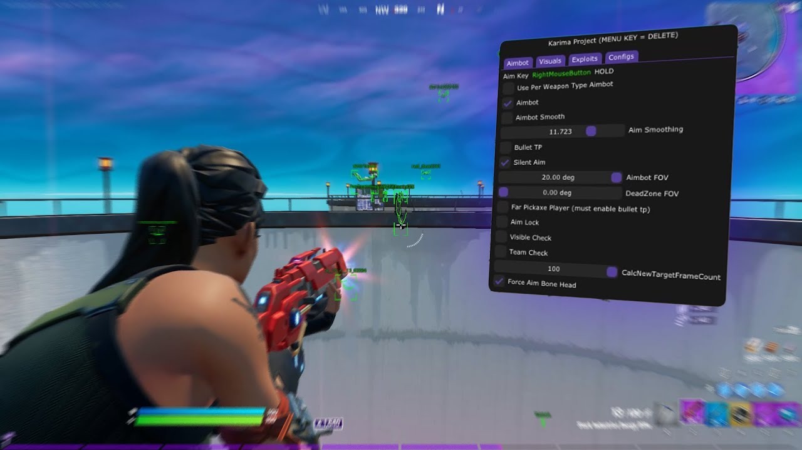

# Retrac Cheat (Karima)



## Table of Contents

[[+] Aimbot](#overview)  
[[+] Wallhack](#overview)  
[[+] Fly (Fly over all the lobby)](#overview)  
[[+] Fully Headshot](#overview)  
[[+] Nonestop Shot (Too fast)](#overview)  

---

## Purpose

The main goals of this project are:

- Teach advanced modular software architecture.  
- Demonstrate memory reading and writing in a controlled environment.  
- Provide examples of hotkey integration and event handling.  
- Offer a real-world example of configuration-driven feature toggling.  
- Show best practices for code documentation, project organization, and development workflows.

By exploring this project, learners can gain insight into complex software design while ensuring their experiments remain entirely legal.

---

## Features

The project includes the following simulated modules and systems:

1. **Memory Manager Simulation**  
   - Learn how memory can be read and manipulated in a safe sandbox.  
   - Understand pointers, addresses, and memory offsets.  

2. **Module Loader**  
   - Demonstrates loading and unloading independent modules at runtime.  
   - Each module can be toggled independently to test isolated functionality.  

3. **Configuration System**  
   - Full JSON-based configuration for all modules.  
   - Supports hotkey mapping, parameter tuning, and saving/loading settings.  

4. **Hotkey Integration**  
   - Bind keys to enable or disable features dynamically.  
   - Helps understand event-driven programming.  

5. **Logging System**  
   - Detailed logs showing module activation, parameter values, and runtime events.  
   - Encourages learning debugging and monitoring techniques.

6. **Simulation Environment**  
   - Provides a virtual sandbox where learners can safely test all features.  
   - Includes pre-built “dummy targets” to simulate game entities.  

---

## Installation

To set up this educational framework:

1. **Clone the repository:**

```bash
git clone https://github.com/yourusername/fortnite-educational.git
cd fortnite-educational
